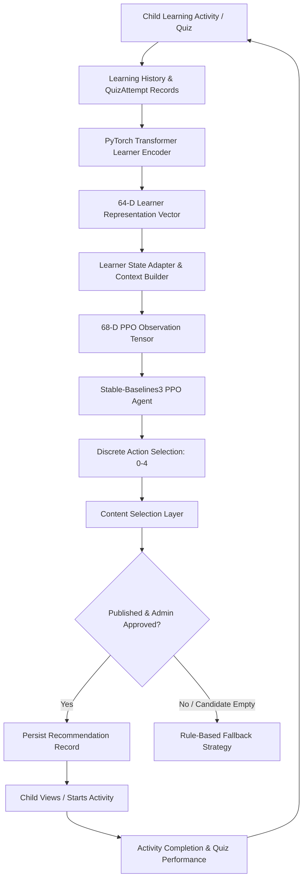

# End-to-End AI Architecture & Recommendation System Specification

## 1. Overview & Data Flowchart

The **Transformer-Based Personalized Learning Recommendation System** integrates sequential feature extraction, discrete Deep Reinforcement Learning (PPO), and strict admin content approval boundaries into a closed-loop feedback system.



---

## 2. Recommendation Strategy Configuration

The recommendation system utilizes a centralized strategy selector configured via `RECOMMENDATION_STRATEGY` in `backend/app/core/config.py`:

| Strategy Mode | Behavior & Orchestration |
|---|---|
| `RULE_BASED` | Always uses the rule-based baseline strategy ($N=3$ recent score window). |
| `TRANSFORMER_PPO` | Uses Transformer + PPO when models are verified; fails safely to `rule_based` if unavailable. |
| `AUTO` (Default) | Uses Transformer + PPO for learners with sufficient history ($\ge 3$ interactions); otherwise uses rule-based cold start fallback. |

> **Note**: Recommendation strategy selection is enforced strictly at the backend level. Ordinary child users cannot manually choose the strategy.

---

## 3. AI Availability Matrix & Cold-Start Protocol

Before executing AI inference, `AIAvailabilityService` evaluates:
1. **Transformer Availability**: PyTorch learner state extractor initialized and functional.
2. **PPO Availability**: Agent model checkpoint verified (`ml/models/ppo_recommendation_agent.zip`).
3. **Learner History Threshold**: Total completed interactions $\ge \text{MIN\_INTERACTIONS\_FOR_AI}$ (default: `3`).
4. **Cold-Start Fallback**: Learners with insufficient history cleanly fall back to `rule_based` recommendations (`recommendation_type = "rule_based"`).

---

## 4. Content Selection & Approval Boundary

The `ContentSelectionService` maps discrete PPO actions ($0-4$) to published curriculum content:

| Action Code | Action Name | Selection Strategy & Boundary Enforcement |
|---|---|---|
| `0` | `REVIEW_PREVIOUS_TOPIC` | Selects published review content from a recently studied topic. |
| `1` | `EASIER_CONTENT` | Selects published lower difficulty content in current topic (`easy`). |
| `2` | `SAME_DIFFICULTY` | Selects published content matching current difficulty. |
| `3` | `HARDER_CONTENT` | Selects published higher difficulty content (`medium`/`hard`). |
| `4` | `PRACTICE_CONTENT` | Selects published interactive practice content (`content_type="practice"`). |

### Content Boundary Safeguards
- **Strict Published Filter**: Only content where `is_published == True` can be selected.
- **Repetition Avoidance Hierarchy**:
  1. Uncompleted and not recently recommended content (Highest priority).
  2. Uncompleted content.
  3. Re-recommend published content (Fallback).

---

## 5. Recommendation Lifecycle

```
[recommended] ──(Child opens dashboard/page)──> [viewed] ──(Activity completed)──> [completed]
```

- `recommended`: Freshly generated active recommendation.
- `viewed`: Marked when child clicks "Start Learning" or views module.
- `completed`: Marked upon completing the learning module or submitting quiz.

---

## 6. Security & Role Authorization

- **Child User**: Can view and trigger recommendations strictly for their own profile.
- **Parent User**: Can view current recommendation and progress metrics strictly for linked children (`ParentChild` relation).
- **Admin User**: System-wide access to AI status matrix (`/api/recommendations/ai-status`) and full recommendation logs (`/api/recommendations/admin/all`).

---

## 7. Implementation Status Matrix

| Component | Status | Details |
|---|---|---|
| Architecture & Data Pipeline | **IMPLEMENTED** | End-to-end integration complete. |
| Transformer Learner Encoder | **IMPLEMENTED** | 64-D positional encoder with masked mean pooling. |
| PPO Environment & Reward | **IMPLEMENTED** | 68-D state Gymnasium environment and reward calculator. |
| PPO Model Checkpoint | **TRAINED** | Agent trained for 10,000 timesteps (`ml/models/ppo_recommendation_agent.zip`). |
| End-to-End Inference Flow | **TESTED & VERIFIED** | 16/16 unit and integration tests passed (`tests/test_end_to_end_ai_recommendation.py`). |
